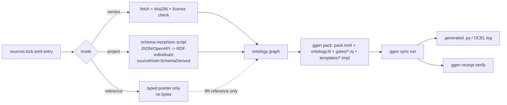

# PRD/ARD: GymAct Semantic Composition for Sony FDE-Shaped Gyms

Last updated: 2026-08-12. Status vocabulary follows this repo's own
`ALIVE` / `PARTIAL_ALIVE` / `BLOCKED:<reason>` / `UNKNOWN` / `UNSUPPORTED`
convention — see `.claude/rules/standing-law.md` in `~/autofde-lab` for
the canonical definitions this document reuses rather than restates.

## 1. Problem / current state (as-is)

The working-backwards press release for this effort (`docs/` chat log,
same date) describes a target: GymAct gyms generated from the
cross-product of real public ontologies, so a Sony-shaped benchmark
scenario is a materialized graph traversal instead of a hand-typed YAML
scenario. This document inventories what is real today against that
target and sequences the smallest real next steps — it is not the
target restated as a plan.

| Component | Status | Evidence |
|---|---|---|
| `gymact/ggen/cloud-topology-validation-pack` | `ALIVE` | `ggen graph validate`/`sync run`/`receipt verify` all real, this session; 9+25 pytest passing; commits `4299bd4`, `cfc6257`, `5a40c8f` |
| `gymact/ggen/gymact-registry-pack` | `ALIVE` | Closed a real registration gap (`CloudTopologyProvider` unregistered); `test_registry_completeness_chicago.py` 25/25 passing; full suite green twice; commit `3131353` |
| `ggen-marketplace` PR #15 (`agent/vendor-public-semantic-sources`) `sources.lock.toml` | `ALIVE` as a lock file (40 real sources, real steward/license/canonical-URL metadata, real branch/commit/PR verified via `gh`/`git`) | fetched and read this session |
| Same PR's vendored bytes (`vendor/<id>/*`) | `PARTIAL_ALIVE` — zero sources actually materialized yet | `git show` of the branch shows only `sources.lock.toml` + scripts, no `vendor/` payload |
| PR #15's own "BLOCKED: no outbound network" claim | Contradicted, this environment: `curl -sS https://www.w3.org/ns/prov-o.ttl` → `http_code=200`, this session | real command, real output above |
| Schema-morphism scripts (`project` mode: K8s/AWS/Azure/GCP/Terraform/OCI → RDF) | `UNSUPPORTED` — none written | no file found under either repo |
| Any generated gym joining ≥2 of these ontology domains | `UNKNOWN` — not attempted | — |

## 2. Target state for this PRD (deliberately narrow)

One real, generated GymAct Environment whose capability catalog is
produced by joining **two vendor-mode ontologies** (PROV-O, SHACL —
chosen because they're `vendor` mode, already fetchable, and need no
schema-morphism script) against gymact's existing, real
`cloud_topology` facts from `cloud-topology-validation-pack`. Output: a
generated `.py` module (ggen `to:` target), a real OCEL log via
`combinatorial_ocel.py`, and a `ggen receipt verify` pass.

This is explicitly **not** the 40-source vision. Bounding `𝒯` to these
2-3 domains and disclosing the boundary is the point: `𝒰(𝒯)` (this
PRD's scope) is provably exhaustible; `𝒢` (every real gap in a
Sony-shaped FDE surface) is not, and no later milestone in this
document claims otherwise.

## 3. Architecture

Precedent for the `project` arm already exists informally:
`gymact/src/gymact/gyms/cloud_topology.py`'s `load_aws_topology()`
walks `botocore`'s bundled `endpoints.json` and emits `CloudRegion`/
`CloudService` dataclasses — the same shape a K8s-OpenAPI-to-RDF script
would take, just not yet expressed as RDF output or wired through ggen.

## 4. Milestones

Each milestone lists the real command a reader can run to check it —
no milestone is "done" without that command's real output.

**M1 — materialize 3 real `vendor`-mode sources.**
Run `ggen-marketplace`'s `packs/autofde-semantic-registry-pack/sources/materialize.py`
against `prov-o`, `dcat-3`, `shacl` only (already `vendor` mode in
`sources.lock.toml`, no schema-morphism script needed).
Verify: `sha256sum vendor/prov-o/*.ttl` matches a value recorded in a
commit; `python3 validate.py` (already present in the PR) exits 0.

**M2 — one real `project`-mode schema-morphism script.**
Kubernetes OpenAPI (`kubectl` is on `~/gymact`'s host machine, or the
public `raw.githubusercontent.com/.../swagger.json` fetched this
session at `http_code=200`) → RDF individuals, `sourceKind =
"SchemaDerived"` literal on every emitted class, following
`load_aws_topology()`'s existing region/service extraction pattern.
Verify: a real SPARQL query against the emitted graph returns ≥1 row
per real K8s `apiVersion`/`kind` pair present in the fetched spec.

**M3 — one generated, joined gym.**
A new `templates/*.tmpl` in a new pack joining M1's PROV-O/SHACL facts
and M2's K8s facts against `gymact-registry-pack`'s existing
`cv:CloudProvider` individuals. Output wired into
`combinatorial_ocel.py`'s existing `GYM_FACTOR`.
Verify: `ggen receipt verify` (`valid=true`), a real
`.venv/bin/python -m pytest` pass on a new Chicago-style test file, and
a real OCEL log with `truncated=False` for this pack's own bounded
`𝒰(𝒯)`.

**M4 — explicitly out of scope near-term (named, not hidden).**
The remaining ~35 `sources.lock.toml` entries; every `reference`-mode
source's redistribution-rights resolution; the ontologies this
session's gap analysis found entirely absent from PR #15 (C2PA,
RightsML specifically, MITRE ATLAS, ESCO/NIST NICE/CTDL,
SPEM/OSLC, SLSA/in-toto, CDEvents). None of these block M1-M3.

## 5. Risks / open questions

- **Redistribution licensing is a legal question per source, not a
  technical one.** `sources.lock.toml`'s `license = "see upstream"`
  entries (the majority) need a real per-source determination before
  `vendor` mode is safe to use for them — M1 deliberately picked the
  3 sources with unambiguous W3C licenses to avoid this question for
  now.
- **`project`-mode scripts version-drift** as provider schemas change
  (AWS/Azure/GCP/K8s/Terraform all ship new API versions continuously)
  — no staleness-detection convention exists yet for this class of
  source, unlike `cloud_topology_validation.py`'s `staleAfterDays`
  mechanism for Azure/GCP snapshots.
- **Concurrent-agent collision, observed twice this session**: the
  `public-ontology-admission-pack` files appeared mid-session from an
  unrelated concurrent process, and `terraform_plan.py`'s docstring fix
  was silently reverted by something else running against the same
  checkout. Anyone continuing M1-M3 should commit immediately after
  each verified-green step, per this session's own established
  practice, given the demonstrated risk of losing uncommitted work.

## 6. Non-goals

This document does not target, and no milestone above claims, "no
possible gaps." `𝒰(𝒯)` — the cross-product of whatever taxonomy `𝒯`
this PRD or its successors admit — is provably exhaustible and
`truncated=False` is a real, checkable claim about it. `𝒢`, the space
of all real-world defects a Sony FDE engagement could actually
encounter, is not reducible to any finite `𝒯`, and no amount of adding
ontologies changes that structurally. The honest artifact this
document produces is a named, growing `𝒰(𝒯)` with a disclosed,
standing `𝒢 \ 𝒰(𝒯) = UNKNOWN` remainder — not a certificate of
completeness.

## See also

- `~/gymact/ggen/cloud-topology-validation-pack/`, `~/gymact/ggen/gymact-registry-pack/` — the two real precedents this plan extends.
- `~/gymact/src/gymact/combinatorial.py`, `~/gymact/src/gymact/combinatorial_ocel.py` — the real Design-for-Combinatorial-Maximum engine M3 wires into.
- `~/ggen-marketplace/packs/autofde-semantic-registry-pack/` (branch `agent/vendor-public-semantic-sources`, PR #15) — the real source registry M1/M2 draw from.
